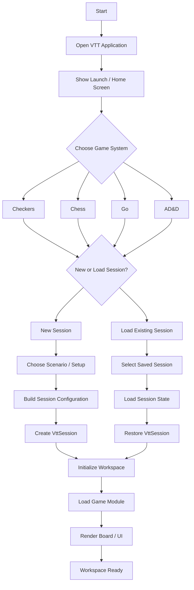
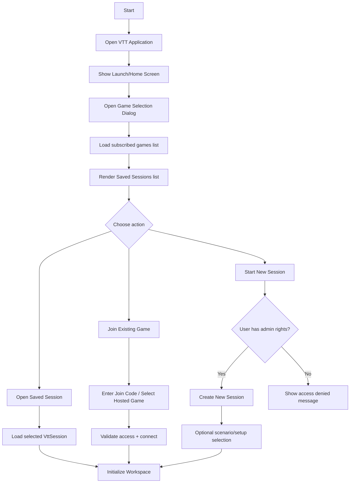
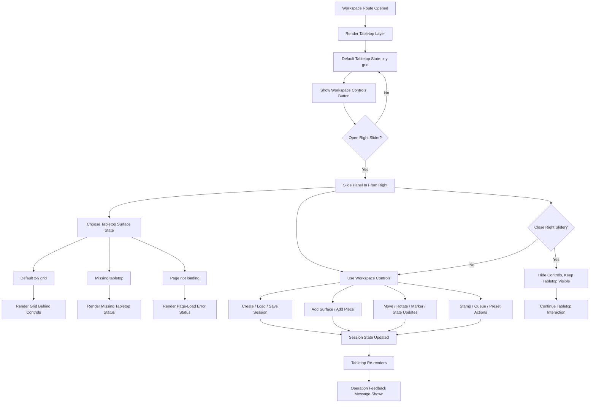

# VTT Workspace Launch Flow Diagram

## 1. System Flow (Engine Perspective)

## 1b. Launch + Game Selector Flow (UI System Perspective)

## 2. Workspace Right-Slider + Tabletop Edit Flow (UI Perspective)

